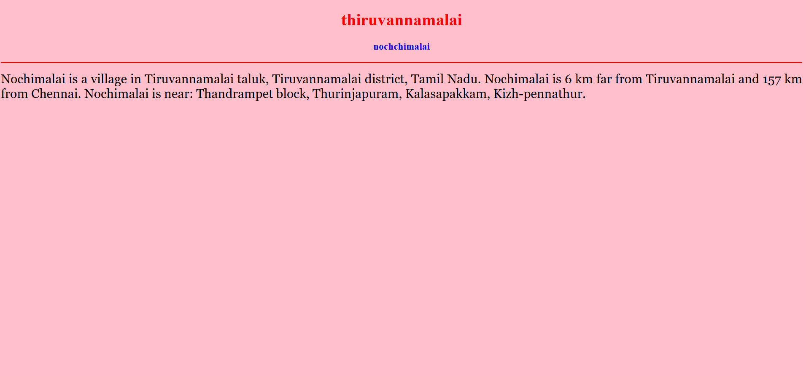
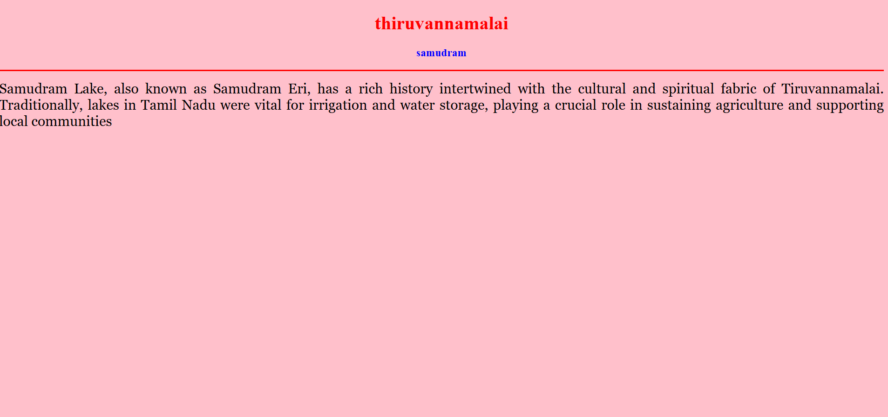
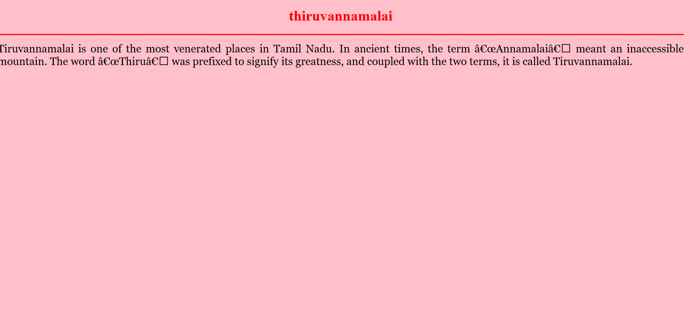
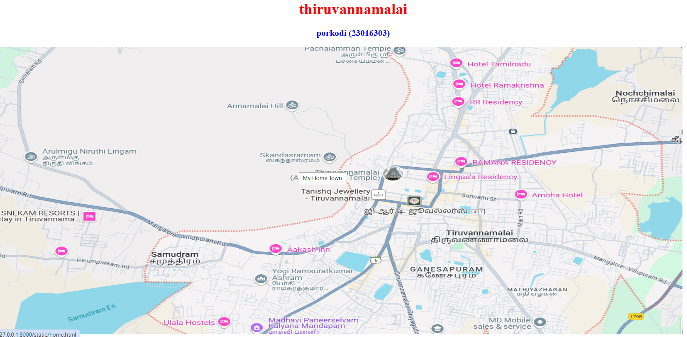

# Ex04 Places Around Me
## Date: 22.04.2025
## name: porkodi
## ref.no: 212224240114

## AIM
To develop a website to display details about the places around my house.

## DESIGN STEPS

### STEP 1
Create a Django admin interface.

### STEP 2
Download your city map from Google.

### STEP 3
Using ```<map>``` tag name the map.

### STEP 4
Create clickable regions in the image using ```<area>``` tag.

### STEP 5
Write HTML programs for all the regions identified.

### STEP 6
Execute the programs and publish them.

## CODE
map.html
```
<!DOCTYPE html>
<html>
<head>
    <title>My City</title>
</head>
<body>
    <h1 align="center"><font color="red"><b>thiruvannamalai</b></font></h1>

    <h3 align="center"><font color="blue"><b>porkodi (23016303)</b></font></h3>

    

    <map name="MyCity">
        <area target="_blank" alt="native" title="native" href="home.html" coords="880,500,1107,582" shape="rect">
        <area target="_blank" alt="samudram" title="samudram" href="river.html" coords="370,606,69" shape="circle">
        <area target="_blank" alt="nochchimalai" title="nochchimalai" href="hill.html" coords="1303,137,101" shape="circle">
    </map>
</body>
</html>
```
home.html
```
<!DOCTYPE html>
<html>
<head>
    <title>My Home Town</title>
</head>
<body bgcolor="pink">
    <h1 align="center">
        <font color="red"><b>thiruvannamalai</b></font>
    </h1>
    <h3 align="center">
        <font color="blue"><b></b></font>
    </h3>
    <hr size="3" color="red">
    <p align="justify">
        <font face="Georgia" size="5">
            Tiruvannamalai is one of the most venerated places in Tamil Nadu. In ancient times, the term “Annamalai” meant an inaccessible mountain. The word “Thiru” was prefixed to signify its greatness, and coupled with the two terms, it is called Tiruvannamalai.   
        </font>
    </p>
</body>
</html>
```
hill.html
```
<!DOCTYPE html>
<html>
<head>
    <title>My Home Town</title>
</head>
<body bgcolor="pink">
    <h1 align="center">
        <font color="red"><b>thiruvannamalai</b></font>
    </h1>
    <h3 align="center">
        <font color="blue"><b>nochchimalai</b></font>
    </h3>
    <hr size="3" color="red">
    <p align="justify">
        <font face="Georgia" size="5">
            Nochimalai is a village in Tiruvannamalai taluk, Tiruvannamalai district, Tamil Nadu. Nochimalai is 6 km far from Tiruvannamalai and 157 km from Chennai. Nochimalai is near: Thandrampet block, Thurinjapuram, Kalasapakkam, Kizh-pennathur.
        </font>
    </p>
</body>
</html>
```
river.html
```
<!DOCTYPE html>
<html>
<head>
    <title>My Home Town</title>
</head>
<body bgcolor="pink">
    <h1 align="center">
        <font color="red"><b>thiruvannamalai</b></font>
    </h1>
    <h3 align="center">
        <font color="blue"><b>samudram</b></font>
    </h3>
    <hr size="3" color="red">
    <p align="justify">
        <font face="Georgia" size="5">
            Samudram Lake, also known as Samudram Eri, has a rich history intertwined with the cultural and spiritual fabric of Tiruvannamalai. Traditionally, lakes in Tamil Nadu were vital for irrigation and water storage, playing a crucial role in sustaining agriculture and supporting local communities  
        </font>
    </p>
</body>
</html>
```

## OUTPUT
   


## RESULT
The program for implementing image maps using HTML is executed successfully.
